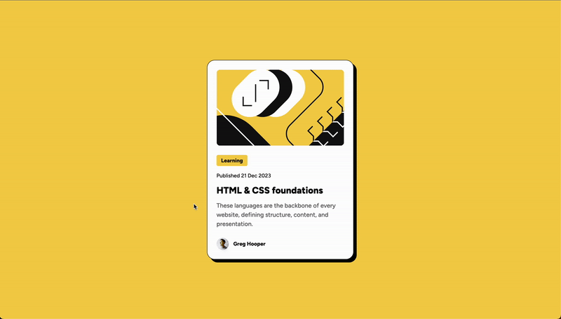
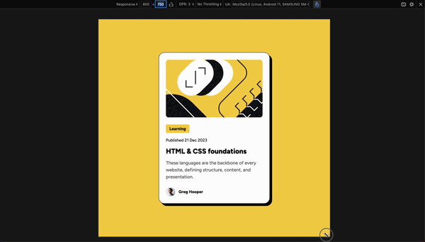

# Blog preview card

This is a solution to the [Blog preview card challenge on Frontend Mentor](https://www.frontendmentor.io/challenges/blog-preview-card-ckPaj01IcS).

## Table of contents

- [Overview](#overview)
  - [The challenge](#the-challenge)
  - [Screenshot](#screenshot)
  - [Links](#links)
- [My process](#my-process)
  - [Built with](#built-with)
  - [What I learned](#what-i-learned)
  - [Continued development](#continued-development)
  - [Useful resources](#useful-resources)
- [Author](#author)
- [Acknowledgments](#acknowledgments)

**Note: Delete this note and update the table of contents based on what sections you keep.**

## Overview

### The challenge

1. See hover and focus states for all interactive elements on the page

    ### Screenshot: Hover
    

2. The font sizes in this project are slightly smaller in the mobile layout. Find a way to reduce font size for smaller screens without using media queries.

    ### Screenshot: Resize
    

### Links

- Solution URL: [Frontend Mentor Solution](https://www.frontendmentor.io/solutions/mdn-docs-wave-extension-5mA4NGYgXD)
- Live Site URL: [coding-vasu-blog-preview.netlify.app](https://coding-vasu-blog-preview.netlify.app/)

## My process

### Built with

- Semantic HTML5 markup
- CSS custom properties
- Flexbox

### What I learned

I learned about he `<time>` tag, which is a tiny time machine for our web page. It's like putting a digital timestamp on our content that both humans and computers can understand.

The <time> tag is used to represent a specific period in time, such as a date, a time, or a combination of both. It's especially useful for events, publication dates, or any time-related information you want to highlight.


```html
<p>
  The next solar eclipse will occur on
  <time datetime="2024-04-08T17:59:00Z">April 8, 2024 at 5:59 PM UTC</time>.
</p>
```
In this example, the visible text shows a human-readable date and time, while the datetime attribute provides a machine-readable format.

```css
/* Changing root font size scales all rem-based elements proportionally */
@media screen and (max-width: 28.5rem) {
  :root {
    --base-font-size: 12px; /* default: 16px */
  }
}

/* Smooth transition for hover effects */
.blog-preview {
    transition: box-shadow 0.4s ease-in-out, color 0.4s ease-in-out;
}

.blog-preview:hover {
    cursor: pointer;
    box-shadow: 1rem 1rem 0 0 black;
    color: var(--color-primary);
}
```

### Continued development

## 🎯 Areas of Focus

1. 👁️ **Pixel-Perfect Precision**
   - Training the designer's eye for intricate details
   - Mastering the art of flawless, high-fidelity layouts

2. 🎬 **Web Animation**
   - Diving deep into the world of CSS and JavaScript animations
   - Crafting interactive elements that bring concepts to life

3. 🚀 **Interactive Blog Creation**
   - Merging design precision with animation magic
   - Building a dynamic platform to showcase and explain web development concepts

### Useful resources

- [MDN Docs](https://developer.mozilla.org/en-US/docs/Web/HTML/Element/time) - This helped me to understand time tag. This is like a bible for html.
- [Markdown](https://www.markdowntutorial.com/) - In each lesson, you’ll be given an introduction to a single Markdown concept. Then, you’ll be asked to complete several exercises with that new knowledge.
- [Wave](https://wave.webaim.org/) - A Web Accessability evaluation tool, available as an extension in all the popular browser.
- [Video to GIF converter](https://ezgif.com/video-to-gif) - This tool helped me to convert video to gif which I am using to showcase.

## Author

- Website - [Coding Vasu](https://coding-vasu.github.io/)
- Frontend Mentor - [@coding-vasu](https://www.frontendmentor.io/profile/coding-vasu)
- Twitter - [@vasu_coding](https://x.com/vasu_coding)

## Acknowledgments

I'd like to express my gratitude to:

- [Emilia Burza](https://www.frontendmentor.io/profile/eburza) from Frontend Mentor: Her valuable feedback helped improve the README.md file, ensuring it effectively communicates my work ethics to potential employers. She also advised on maintaining a clean, distraction-free repository.

- [Frontend Mentor](https://www.frontendmentor.io/): For creating this interactive platform that promotes learning by doing. It's an excellent resource for those looking to break out of tutorial hell or simply wanting to practice their skills. I highly recommend it to anyone in the web development community.