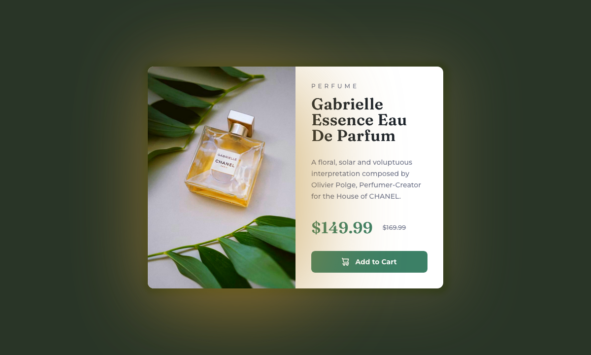

# Product preview card component solution

  
  

This is a solution to the [Product preview card component challenge on Frontend Mentor](https://www.frontendmentor.io/challenges/product-preview-card-component-GO7UmttRfa).

## Table of contents

- [Overview](#overview)
  - [The challenge](#the-challenge)
  - [Screenshot](#screenshot)
  - [Links](#links)
- [My process](#my-process)
  - [Built with](#built-with)
  - [What I learned](#what-i-learned)
  - [Continued development](#continued-development)
  - [Useful resources](#useful-resources)
- [Author](#author)
- [Acknowledgments](#acknowledgments)

**Note: Delete this note and update the table of contents based on what sections you keep.**

## Overview

### The challenge

Users should be able to:

- View the optimal layout depending on their device's screen size
- See hover and focus states for interactive elements

### Screenshot

  
  

### Links

- Solution URL: [Frontend Mentor](https://www.frontendmentor.io/challenges/product-preview-card-component-GO7UmttRfa)
- Live Site URL: [Add live site URL here](https://your-live-site-url.com)

## My process

### Built with

- SCSS: Variables, Mixins
- Flexbox, Grid, Filter
- Responsive Design: Clamp, Media Queries
- Semantic HTML5 markup
- SEO: Meta Tags
- Accessibility: ARIA, Tab index

### What I learned

I learned to use filter to enhance the look & feel of the component.

### Continued development

Learn more above Fluid Responsive design & being comfortable with it.

### Useful resources

- [CSS Filter Property](https://coderpad.io/blog/development/everything-you-need-to-know-about-all-11-css-filters/) - This helped me for learn about filters that I have used in this component.

## Author

- Website - [Coding Vasu](https://coding-vasu.github.io/)
- Frontend Mentor - [@coding-vasu](https://www.frontendmentor.io/profile/coding-vasu)
- Twitter - [@vasu_coding](https://x.com/vasu_coding)

## Acknowledgments

I want to give a shout-out to the frontend community for encouraging us to write and review more code every day, helping us become better developers.