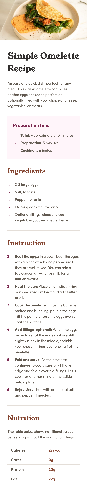
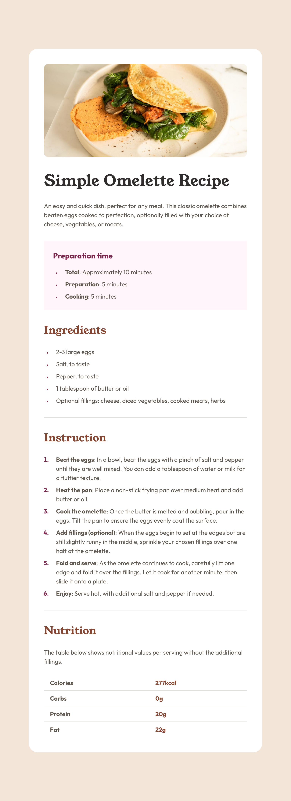
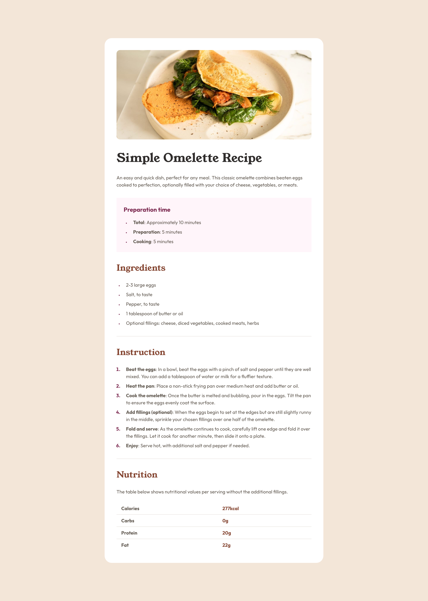

# Recipe page solution

  
  

This is a solution to the [Recipe page challenge on Frontend Mentor](https://www.frontendmentor.io/challenges/recipe-page-KiTsR8QQKm). 

## Table of contents

- [Overview](#overview)
  - [The challenge](#the-challenge)
  - [Screenshot](#screenshot)
  - [Links](#links)
- [My process](#my-process)
  - [Built with](#built-with)
  - [What I learned](#what-i-learned)
  - [Continued development](#continued-development)
  - [Useful resources](#useful-resources)
- [Author](#author)
- [Acknowledgments](#acknowledgments)

## Overview

### Screenshot

  
  
  

  <strong>Mobile</strong>
  <strong>Tablet</strong>
  <strong>Desktop</strong>

### Links

- Solution URL: [Recipe page](https://www.frontendmentor.io/solutions/media-queries-aria-labeling-tabindexing-Sjbp6ubVfc)
- Live Site URL: [Recioe page Live](https://main--omelette-recipe-blog.netlify.app/)

## My process

### Built with

- Semantic HTML5 markup
- CSS custom properties
- CSS Grid
- Mobile-first workflow
- Media Queries For Responsiveness

### What I learned

- Responsiveness was a bit challenging
- Got to more about list attributes & pseudo classes like `::marker`
- Hands on with table
- Lastly accessibility (ARIA labeling & Tab Indexing).

### Continued development

- Clamping Guide & Techniques
- Able to isolate the problem, in order to focus on the issue & resolve it.

### Useful resources

- [List Marker](https://developer.mozilla.org/en-US/docs/Web/CSS/::marker) - This helped me for learn about list marker pseudo class.
- [List Style](https://css-tricks.com/almanac/properties/l/list-style/) - This is an amazing blog for css trick about the list-style property.

## Author

- Website - [Coding Vasu](https://coding-vasu.github.io/)
- Frontend Mentor - [@coding-vasu](https://www.frontendmentor.io/profile/coding-vasu)
- Twitter - [@vasu_coding](https://x.com/vasu_coding)

## Acknowledgments

I want to give a shout-out to the frontend community for encouraging us to write and review more code every day, helping us become better developers.
