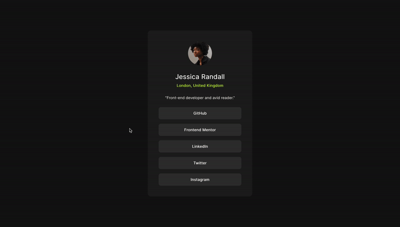
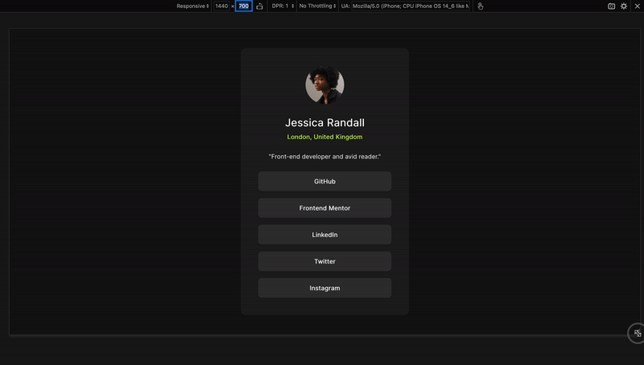
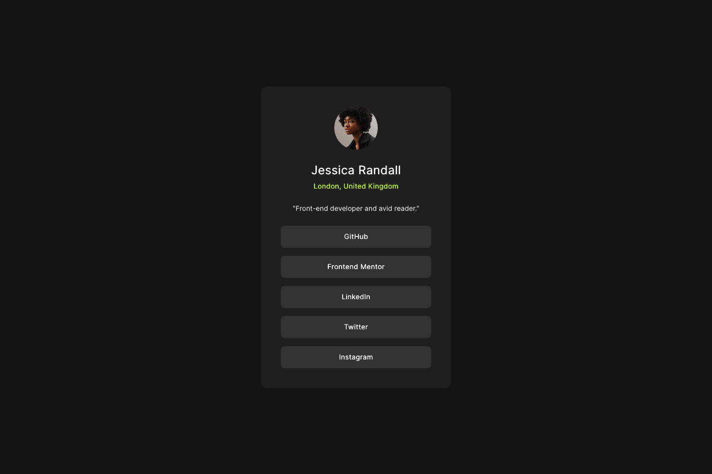
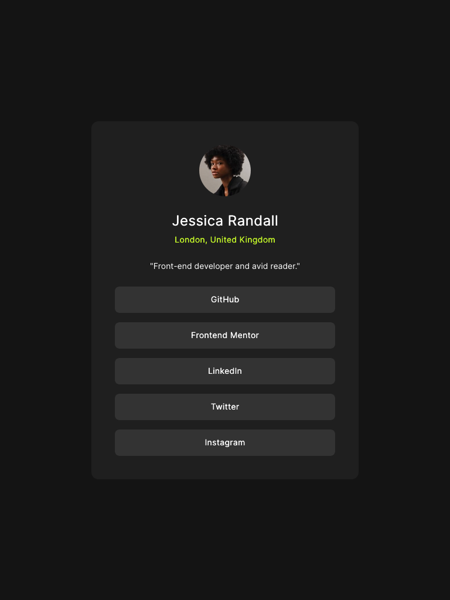
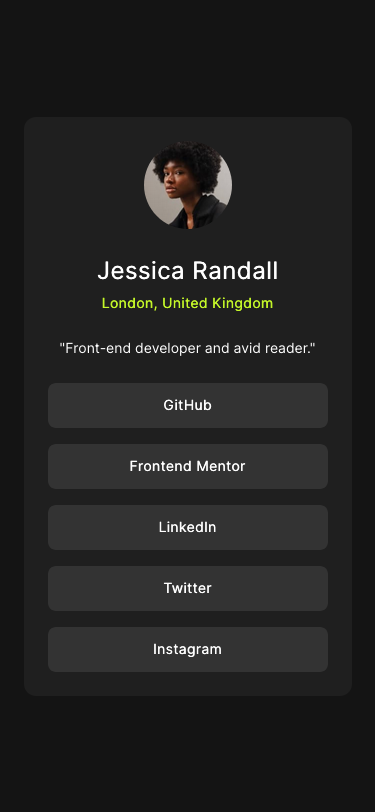

# Social links profile

<p align="center">
  
  
</p>


This is a solution to the [Social links profile challenge on Frontend Mentor](https://www.frontendmentor.io/challenges/social-links-profile-UG32l9m6dQ). 

## Table of contents

- [Overview](#overview)
  - [The challenge](#the-challenge)
  - [Screenshot](#screenshot)
  - [Links](#links)
- [My process](#my-process)
  - [Built with](#built-with)
  - [What I learned](#what-i-learned)
  - [Continued development](#continued-development)
  - [Useful resources](#useful-resources)
- [Author](#author)
- [Acknowledgments](#acknowledgments)

## Overview

### The challenge

Users should be able to:

- See hover and focus states for all interactive elements on the page

### Screenshot
<p float="left">
  
</p>
<p float="left">
  
  
</p>

### Links

- Solution URL: [Frontend Mentor Showcase](https://www.frontendmentor.io/challenges/social-links-profile-UG32l9m6dQ)
- Live Site URL: [Social Links Demo](https://coding-vasu-social-links.netlify.app/)

## My process

### Built with

- Semantic HTML5 markup
- CSS custom properties
- CSS Grid
- Mobile-first workflow
- Clamp For Responsiveness

### What I learned

I have learned to use ARIA for this project, ARIA provides enhanced semantics and accessibility for web content.

```html
<main class="profile-card" aria-label="Jessica Randall's profile card">

<!-- Her role-"list" is the aria property -->
<ul class="profile-card_social-links" role="list"> 

```
Learned new property of link tag `<a>`
```html
<li><a href="https://github.com" target="_blank" rel="noopener noreferrer" class="profile-card_links">GitHub</a></li>
```
`noopener`: This attribute prevents the newly opened page from having access to the original page’s window object.

`noreferrer`: This attribute prevents the browser from sending the HTTP referrer header to the destination site.

### Continued development

I want to learn more about using `clamp` for building responsive layouts. Additionally, I need a better understanding of grid layout.

### Useful resources

- [Font Size Clamp](https://clamp.font-size.app/?config=eyJyb290IjoiMTYiLCJtaW5XaWR0aCI6IjM3NXB4IiwibWF4V2lkdGgiOiIxNDQwcHgiLCJtaW5Gb250U2l6ZSI6IjEzLjY0OHB4IiwibWF4Rm9udFNpemUiOiIxNnB4In0%3D) - This tool assists in creating responsive websites by asking for minimum and maximum values and then generating the appropriate clamp.

- [color name](https://www.color-name.com/hex/ffffff) - This site provides the name for any color based on its hex code.

## Author

- Website - [Coding Vasu](https://coding-vasu.github.io/)
- Frontend Mentor - [@coding-vasu](https://www.frontendmentor.io/profile/coding-vasu)
- Twitter - [@vasu_coding](https://x.com/vasu_coding)


## Acknowledgments

I want to give a shout-out to the frontend community for encouraging us to write and review more code every day, helping us become better developers.
